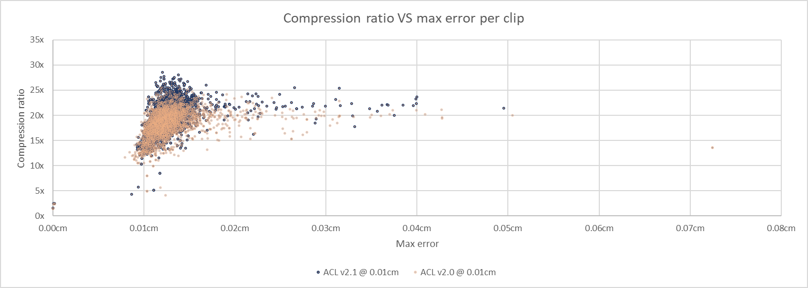
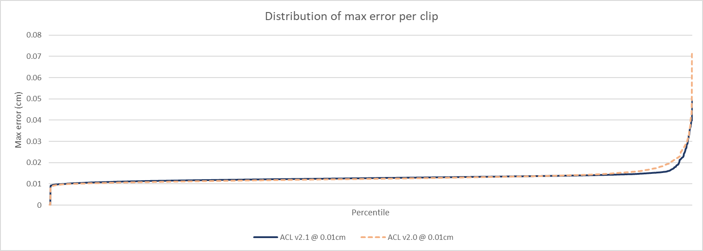

# Carnegie-Mellon University database performance

To compile the statistics, the [animation database from Carnegie-Mellon University](http://mocap.cs.cmu.edu/) is used.
The specific drop of the database that was used to compile these statistics is in FBX form and can be found on the Unity asset store [here](https://www.assetstore.unity3d.com/en/#!/content/19991).
They were converted to the [ACL file format](the_acl_file_format.md) using the [fbx2acl](../tools/fbx2acl) script. Data available upon request, it is far too large for GitHub.

*  Number of clips: **2534**
*  Sample rate: **24 FPS**
*  Total duration: **09h 49m 37.58s**
*  Raw size: **1429.38 MB** (10x float32 * num bones * num samples)

For ACL and Unreal 4, the error is measured **3cm** away from each bone to simulate the visual mesh skinning process as described [here](error_metrics.md).

*  [ACL](cmu_performance.md#acl)
*  [Unreal 4](cmu_performance.md#unreal-4)
*  [Unity 5](cmu_performance.md#unity-5)
*  [Results in images](cmu_performance.md#results-in-images)

# ACL

Statistics for ACL are being generated with the `acl_compressor` tool found [here](../tools/acl_compressor). It supports various compression method, only the best will be tracked here. Every clip uses an error threshold of **0.01cm (0.1mm)**.

*  Compressed size: **67.09 MB**
*  Compression ratio: **21.31 : 1**
*  Max error: **0.0587** centimeters (clip 144_32)
*  Compression time: **01h 23m 51.48s** (single threaded)
*  Compression time: **00h 09m 21.94s** (multi threaded)
*  Best rotation format: Quat Drop W Variable
*  Best translation format: Vector3 Variable
*  Best range reduction format: Per Clip Rotations & Translations, Per Segment Rotations & Translations

Note that you can compress any number of clips in parallel with multiple threads but each clip uses a single thread for now.

**Results from release [0.5.0](https://github.com/nfrechette/acl/releases/tag/v0.5.0)**

See [here](cmu_performance_history.md) for a history of performance progress across the various releases.

# Unreal 4

In order to measure statistics in Unreal 4, ACL was integrated along with a small [commandlet](../tools/ue4_stats_dump) to run the necessary compression and decompression logic. Everything uses the default values from the automatic compression settings which performs an exhaustive search of the best compression variant.

*  Compressed size: **107.94 MB**
*  Compression ratio: **9.27 : 1**
*  Max error: **0.0850** centimeters (clip 128_11)
*  Compression time: **03h 54m 16.43s** (single threaded)

Sadly the Unreal 4 compression logic does not *yet* support multi-threading and must be run from the main thread.

**Results from Unreal 4.15.0**

# Unity 5

Sadly I have not yet managed to find a way to implement a custom error metric in Unity nor how to even sample a clip procedurally in both the raw and/or compressed form. This makes comparing the results somewhat difficult. However I did manage to extract the following statistics with the default compression settings and the `optimal` compression algorithm:

*  Number of muscle curves: **329153**
*  Number of constant curves: **119173**
*  Number of dense curves: **203526**
*  Number of stream curves: **6454**
*  Editor memory footprint: **1.22 GB**
*  Win32 memory footprint: **282 MB**
*  Max error: unknown
*  Compression time: unknown

**Results from Unity 5.6.1f1**

*Contributions welcome on this topic if you are familiar with Unity*

# Results in images

