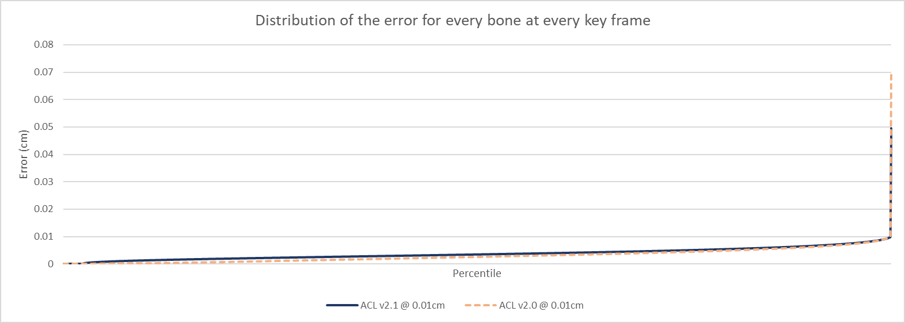
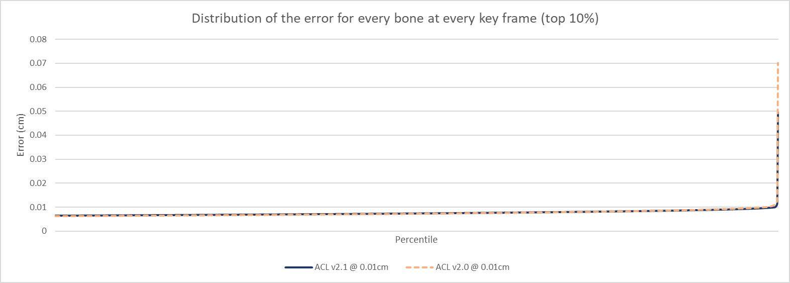

# Carnegie-Mellon University database performance

To compile the statistics, the [animation database from Carnegie-Mellon University](http://mocap.cs.cmu.edu/) is used.
The raw animation clips in FBX form can be found on the Unity asset store [here](https://www.assetstore.unity3d.com/en/#!/content/19991).
They were converted to the [ACL file format](the_acl_file_format.md) using the [fbx2acl](../tools/fbx2acl) script. Data available upon request, it is far too large for GitHub.

*  Number of clips: **2534**
*  Sample rate: **24 FPS**
*  Total duration: **09h 49m 37.58s**
*  Raw size: **1429.38 MB** (10x float32 * num bones * num samples)

ACL supports various compression methods but only the overall best variant will be tracked here (see `get_default_compression_settings()` for details).

The error is measured **3cm** away from each bone to simulate the visual mesh skinning process as described [here](error_metrics.md).

The performance of ACL in Unreal Engine 4 is tracked by the plugin [here](https://github.com/nfrechette/acl-ue4-plugin/blob/develop/Docs/cmu_performance.md).

# Summary

*  Compressed size: **67.02 MB**
*  Compression ratio: **21.33 : 1**
*  Max error: **0.0703** centimeters (clip *83_11*)
*  Compression time: **37m 13.14s** (single threaded)
*  Compression time: **10m 11.49s** (multi threaded on 4 cores)

Note that you can compress any number of clips in parallel with multiple threads but each clip uses a single thread for now.

**Results from release [1.0.0](https://github.com/nfrechette/acl/releases/tag/v1.0.0)**

See [here](cmu_performance_history.md) for a history of performance progress across the various releases.

# Results in images

