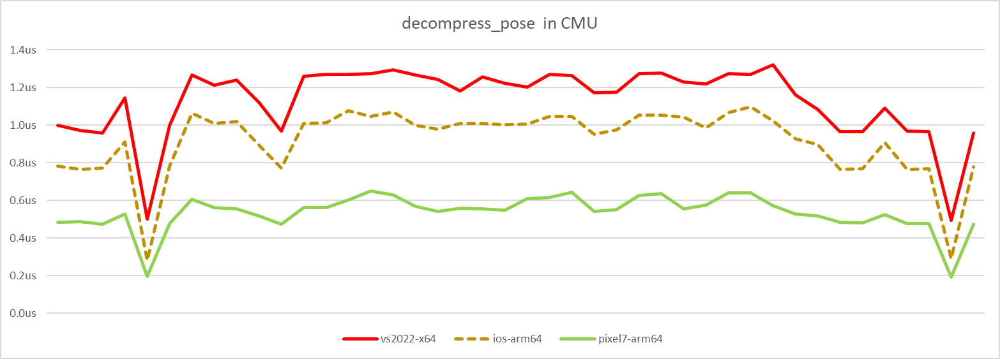
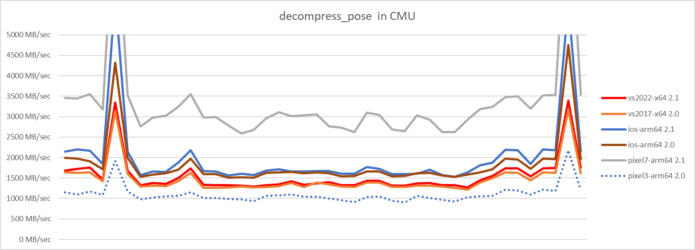
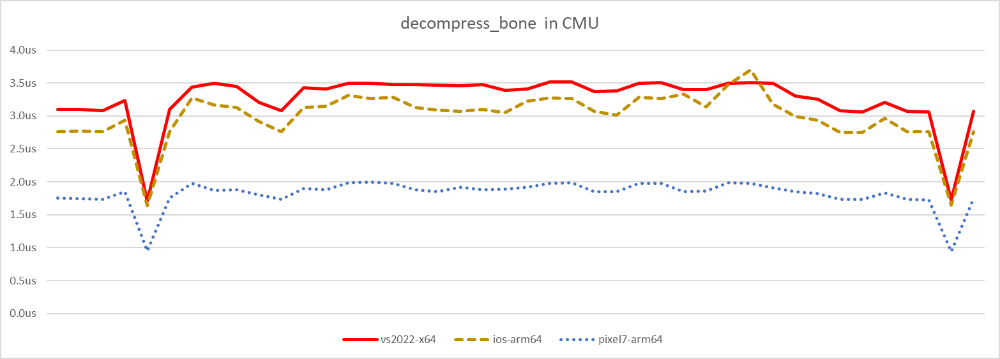
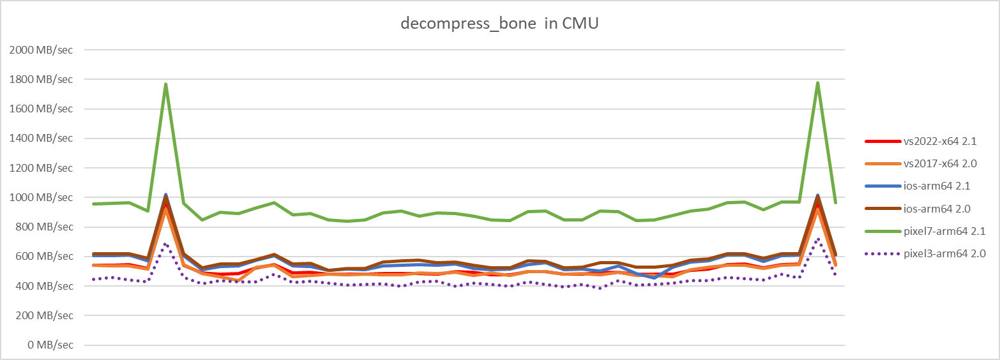

# Decompression performance

In order to measure the decompression performance, the [acl_decompressor](../tools/acl_decompressor) tool is used to extract the relevant metrics and a [python script](../tools/graph_generation) is used to parse them.

Here are the clips we measure on:

*  The 42 [regression clips](../test_data) from [CMU](cmu_performance.md) database
*  The 5 clips from the [Matinee fight](fight_scene_performance.md) scene

Note that the data is not yet conveniently packaged.

Here are the platforms we measure on:

*  Desktop: Ryzen 2950X @ 3.5 GHz
*  Phone: Android Pixel 3 @ 2.5 GHz (for v2.0 and earlier)
*  Phone: Android Pixel 7 @ 2.85 GHz (for v2.1 and later)
*  Tablet: iPad Pro 10.5 inch @ 2.39 GHz

We only show a few compilers and architectures to keep the graphs readable.

**Unless otherwise specified, the results are from release [2.1.0](https://github.com/nfrechette/acl/releases/tag/v2.1.0)**

## Uniformly sampled algorithm

The uniformly sampled algorithm offers consistent performance regardless of the playback direction. Shown here is the median performance of `decompress_pose` with a cold CPU cache for **3** clips with forward, backward, and random playback on the *iPad*.

| Clip Name    | Forward   | Backward  | Random    |
| ------------ | --------- | --------- | --------- |
| 104_30       | 0.910 us  | 0.961 us  | 0.960 us  |
| Trooper_1    | 2.304 us  | 2.137 us  | 2.354 us  |
| Trooper_Main | 28.837 us | 29.782 us | 29.918 us |

As can be seen, the performance is consistent regardless of the playback direction. It also remains consistent regardless of the clip sample rate and the clip playback rate.

### decompress_pose

This function decompresses a whole pose in one go. Shown here is forward playback with a cold CPU cache.

Here is the delta with the previous version:

### decompress_bone

This function decompresses a single bone. To generate the graphs, we measure the cost of decompressing a whole pose one bone at a time. Shown here is forward playback with a cold CPU cache.

Here is the delta with the previous version:

