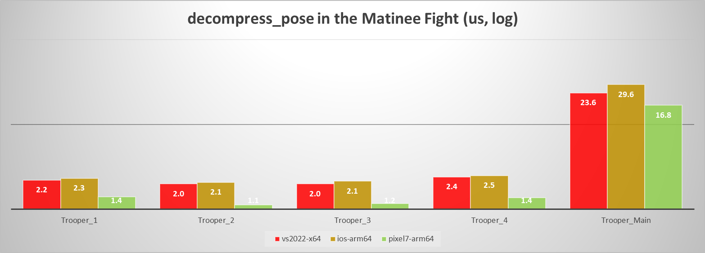
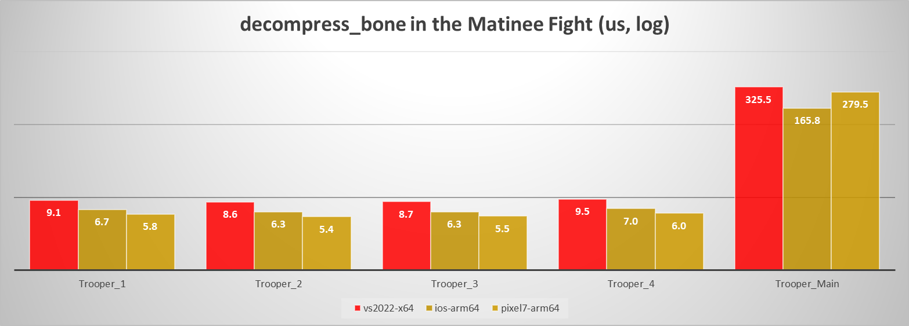

# Decompression performance

In order to measure the decompression performance, the [acl_decompressor](../tools/acl_decompressor) tool is used to extract the relevant metrics and a [python script](../tools/graph_generation) is used to parse them.

Here are the clips we measure on:

*  The 42 [regression clips](../test_data) from [CMU](cmu_performance.md) database
*  The 5 clips from the [Matinee fight](fight_scene_performance.md) scene

Note that the data is not yet conveniently packaged.

Here are the platforms we measure on:

*  Desktop: Intel i7-6850K @ 3.8 GHz
*  Laptop: MacBook Pro mid 2014 @ 2.6 GHz
*  Phone: Android Nexus 5X @ 1.8 GHz
*  Tablet: iPad Pro 10.5 inch @ 2.39 GHz

We only show a few compilers and architectures to keep the graphs readable. The *Visual Studio 2017* numbers are nearly identical to *Visual Studio 2015* and are omitted for that reason. *GCC 7* lands in between *VS 2015* and *Clang 5* and is omitted. Only *VS 2015* is shown for *x86* because it is generally a bit slower than the *x64* variant for all compilers and it isn't commonly used in games.

**Unless otherwise specified, the results are from release [1.0.0](https://github.com/nfrechette/acl/releases/tag/v1.0.0)**

## Uniformly sampled algorithm

The uniformly sampled algorithm offers consistent performance regardless of the playback direction. Shown here is `decompress_pose` with a cold CPU cache: forward is **Red**, backward is **Green**, and random is **Blue**.

### decompress_pose

This function decompresses a whole pose in one go. Shown here is forward playback with a cold CPU cache.

Here is the delta with the previous version:

### decompress_bone

This function decompresses a single bone. To generate the graphs, we measure the cost of decompressing a whole pose one bone at a time. Shown here is forward playback with a cold CPU cache.

Here is the delta with the previous version:

