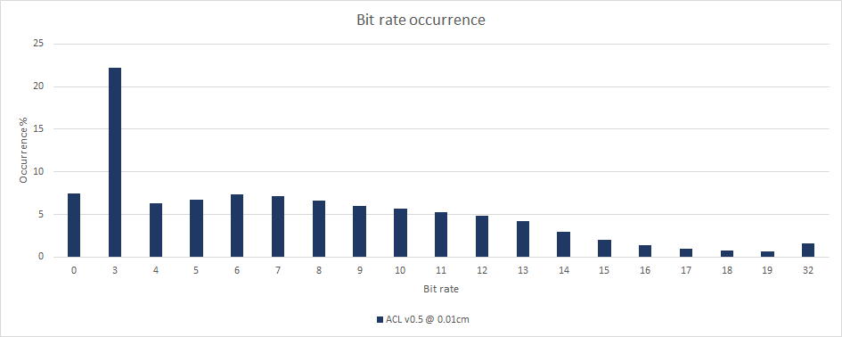

# Paragon database performance

To compile the statistics, a large number of animations from [Paragon](https://www.epicgames.com/paragon) are used.
In October 2017 the animations were extracted and converted to the [ACL file format](the_acl_file_format.md) losslessly. The data is sadly **NOT** available upon request.
Epic has permitted [Nicholas Frechette](https://github.com/nfrechette) to use them for research purposes only under a non-disclosure agreement.

*  Number of clips: **6558**
*  Total duration: **07h 00m 45.27s**
*  Raw size: **4276.11 MB** (10x float32 * num bones * num samples)

The data set contains among other things:

*  Lots of characters with varying number of bones
*  Animated objects of various shape and form
*  Very short and very long clips
*  Clips with unusual sample rate (as low as **2** FPS!)
*  World space clips
*  Lots of 3D scale
*  Lots of other exotic clips

The error is measured **3cm** away from each bone to simulate the visual mesh skinning process as described [here](error_metrics.md).

*  [ACL](paragon_performance.md#acl)
*  [Unreal 4](paragon_performance.md#unreal-4)
*  [Results in images](paragon_performance.md#results-in-images)

# ACL

Statistics for ACL are being generated with the `acl_compressor` tool found [here](../tools/acl_compressor). It supports various compression method, only the best will be tracked here. Every clip uses an error threshold of **0.01cm (0.1mm)**.

*  Compressed size: **205.69 MB**
*  Compression ratio: **20.79 : 1**
*  Max error: **9.7920** centimeters
*  Compression time: **19h 04m 25.11s** (single threaded)
*  Compression time: **01h 53m 42.84s** (multi threaded)
*  Best rotation format: Quat Drop W Variable
*  Best translation format: Vector3 Variable
*  Best range reduction format: Per Clip Rotations & Translations, Per Segment Rotations & Translations

Notes:

*  You can compress any number of clips in parallel with multiple threads but each clip uses a single thread for now.
*  The error is unacceptably high for **3** exotic clips, to be fixed in the next release

**Results from release [0.5.0](https://github.com/nfrechette/acl/releases/tag/v0.5.0)**

# Unreal 4

In order to measure statistics in Unreal 4, ACL was integrated along with a small [commandlet](../tools/ue4_stats_dump) to run the necessary compression and decompression logic. Everything uses the default values from the automatic compression settings which performs an exhaustive search of the best compression variant.

*  Compressed size: **496.24 MB**
*  Compression ratio: **8.62 : 1**
*  Max error: **0.8619** centimeters
*  Compression time: **19h 56m 50.37s** (single threaded)

Notes:

*  Sadly the Unreal 4 compression logic does not *yet* support multi-threading and must be run from the main thread.
*  Down-sampling variants were disabled to avoid a crash. This negatively impacts the compressed size but not by much and on the other hand it very positively impacts the compression time.

**Results from Unreal 4.15.0**

# Results in images

