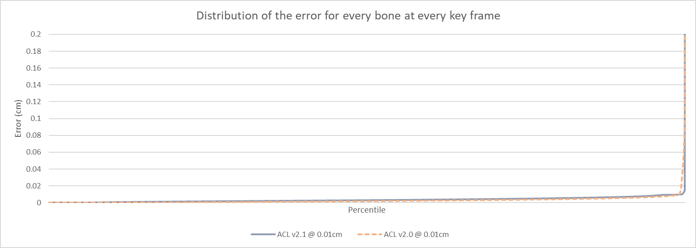

# Paragon database performance

To compile these statistics, a large number of animations from [Paragon](https://www.epicgames.com/paragon) are used.

In *October 2017* the animations were manually extracted and converted to the [ACL file format](the_acl_file_format.md) losslessly. The data is sadly **NOT** available upon request.
Epic has permitted [Nicholas Frechette](https://github.com/nfrechette) to use them for research purposes only under a non-disclosure agreement.

**Note: Epic has since released Paragon assets publicly in early 2018, once I get around to it, it will be extracted and made available along with updated stats.**

*  Number of clips: **6558**
*  Total duration: **07h 00m 45.27s**
*  Raw size: **4276.11 MB** (10x float32 * num bones * num samples)

The data set contains among other things:

*  Lots of characters with varying number of bones
*  Animated objects of various shape and form
*  Very short and very long clips
*  Clips with unusual sample rate (as low as **2** FPS!)
*  World space clips
*  Lots of 3D scale
*  Lots of other exotic clips

ACL supports various compression methods but only the overall best variant will be tracked here (see `get_default_compression_settings()` for details).

The error is measured **3cm** away from each bone to simulate the visual mesh skinning process as described [here](error_metrics.md).

The performance of ACL in Unreal Engine 4 is tracked by the plugin [here](https://github.com/nfrechette/acl-ue4-plugin/blob/develop/Docs/paragon_performance.md).

# Summary

*  Compressed size: **206.09 MB**
*  Compression ratio: **20.75 : 1**
*  Max error: **3.8615** centimeters
*  Compression time: **07h 48m 52.03s** (single threaded)
*  Compression time: **02h 06m 34.97s** (multi threaded on 4 cores)

Notes:

*  You can compress any number of clips in parallel with multiple threads but each clip uses a single thread for now.
*  The error is unusually high (above **1cm**) for **6** exotic clips.

**Results from release [1.0.0](https://github.com/nfrechette/acl/releases/tag/v1.0.0)**

See [here](paragon_performance_history.md) for a history of performance progress across the various releases.

# Results in images

