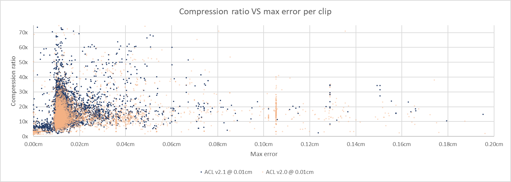

# Paragon database performance

To compile the statistics, a large number of animations from [Paragon](https://www.epicgames.com/paragon) are used.
In October 2017 the animations were extracted and converted to the [ACL file format](the_acl_file_format.md) losslessly. The data is sadly **NOT** available upon request.
Epic has permitted [Nicholas Frechette](https://github.com/nfrechette) to use them for research purposes only under a non-disclosure agreement.

**Note: Epic has released Paragon assets publicly in early 2018, once we get around to it, it will be extracted and made available along with updated stats.**

*  Number of clips: **6558**
*  Total duration: **07h 00m 45.27s**
*  Raw size: **4276.11 MB** (10x float32 * num bones * num samples)

The data set contains among other things:

*  Lots of characters with varying number of bones
*  Animated objects of various shape and form
*  Very short and very long clips
*  Clips with unusual sample rate (as low as **2** FPS!)
*  World space clips
*  Lots of 3D scale
*  Lots of other exotic clips

The error is measured **3cm** away from each bone to simulate the visual mesh skinning process as described [here](error_metrics.md).

*  [ACL](paragon_performance.md#acl)
*  [Unreal 4](paragon_performance.md#unreal-4)
*  [Results in images](paragon_performance.md#results-in-images)

# ACL

Statistics for ACL are being generated with the `acl_compressor` tool found [here](../tools/acl_compressor). It supports various compression method but only the overall best variant will be tracked here: variable bit rate with range reduction enabled. Every clip uses an error threshold of **0.01cm (0.1mm)**.

*  Compressed size: **205.58 MB**
*  Compression ratio: **20.80 : 1**
*  Max error: **3.8615** centimeters
*  Compression time: **09h 43m 41.08s** (single threaded)
*  Compression time: **02h 37m 23.60s** (multi threaded on 4 cores)

Notes:

*  You can compress any number of clips in parallel with multiple threads but each clip uses a single thread for now.
*  The error is unusually high for **3** exotic clips

**Results from release [0.7.0](https://github.com/nfrechette/acl/releases/tag/v0.7.0)**

See [here](paragon_performance_history.md) for a history of performance progress across the various releases.

# Unreal 4

In order to measure statistics in *Unreal 4*, ACL was integrated along with a small [commandlet](../tools/ue4_stats_dump) to run the necessary compression and decompression logic. Everything uses the default values from the automatic compression settings which performs an exhaustive search of the best compression variant. As described [here](http://nfrechette.github.io/2017/01/11/anim_compression_unreal4/), the automatic compression tries many algorithms and settles on the best memory footprint that is also under the desired error threshold. The default error threshold is **1.0cm** but here we used **0.1cm** which is more realistic for production use.

*  Compressed size: **493.97 MB**
*  Compression ratio: **8.66 : 1**
*  Max error: **1.0404** centimeters
*  Compression time: **20h 16m 27.87s** (single threaded)

Sadly the *Unreal 4* compression logic does not *yet* support multi-threading and must be run from the main thread.

*Note: Down-sampling variants were causing issues and were disabled in the interest of keeping things fair. This speeds up the compression time considerably but does not affect the compressed size much*

**Results from Unreal 4.15.0**

# Results in images

