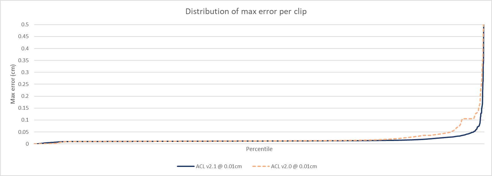
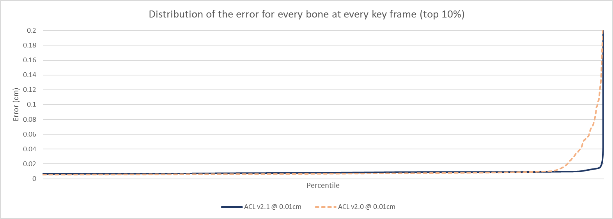

# Paragon database performance

|                       | v1.1.0        | v1.0.0        | v0.8.0        |
| --------------------- | ------------- | ------------- | ------------- |
| **Compressed size**   | 206.65 MB     | 206.57 MB     | 206.09 MB     |
| **Compression ratio** | 20.69 : 1     | 20.70 : 1     | 20.75 : 1     |
| **Compression time**  | 7h 14m 54.53s | 7h 57m 41.72s | 7h 30m 46.44s |
| **Compression speed**  | 167.80 KB/sec | 152.77 KB/sec | 161.90 KB/sec |
| **Max error**         | 7.0175 cm     | 7.0159 cm     | 3.8615 cm     |
| **Error 99th percentile** | 0.0116 cm | 0.0116 cm | 0.0113 cm |
| **Samples below error threshold** | 98.81 % | 98.81 % | 98.83 % |

Notes:

*  The error is unusually high and above **1cm** for **6** exotic clips
*  **v1.0.0** is **NOT** less accurate, a bug was fixed that partially hid the true error with 3D scale in prior versions

# Data and method used

To compile these statistics, a large number of animations from [Paragon](https://www.epicgames.com/paragon) are used.

In *October 2017* the animations were manually extracted and converted to the [ACL file format](the_acl_file_format.md) losslessly. The data is sadly **NOT** available upon request.
Epic has permitted [Nicholas Frechette](https://github.com/nfrechette) to use them for research purposes only under a non-disclosure agreement.

**Note: Epic has since released Paragon assets publicly in early 2018, once I get around to it, it will be extracted along with updated stats.**

*  Number of clips: **6558**
*  Total duration: **7h 00m 45.27s**
*  Raw size: **4276.11 MB** (10x float32 * num bones * num samples)

The data set contains among other things:

*  Lots of characters with varying number of bones
*  Animated objects of various shape and form
*  Very short and very long clips
*  Clips with unusual sample rate (as low as **2** FPS!)
*  World space clips
*  Lots of 3D scale
*  Lots of other exotic clips

ACL supports various compression methods but only the overall best variant will be tracked here (see `get_default_compression_settings()` for details).

The error is measured **3cm** away from each bone to simulate the visual mesh skinning process as described [here](error_metrics.md) with the default error threshold of **0.01cm**. The **99th** percentile and the number of samples below the error threshold are calculated by measuring the error on every bone at every sample.

The performance of ACL in Unreal Engine 4 is tracked by the plugin [here](https://github.com/nfrechette/acl-ue4-plugin/blob/develop/Docs/paragon_performance.md).

# Results in images

